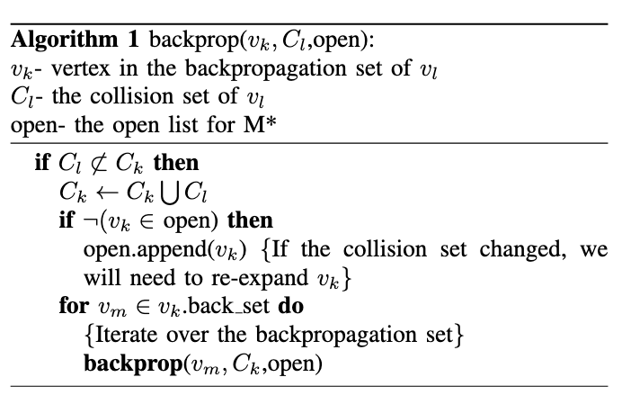
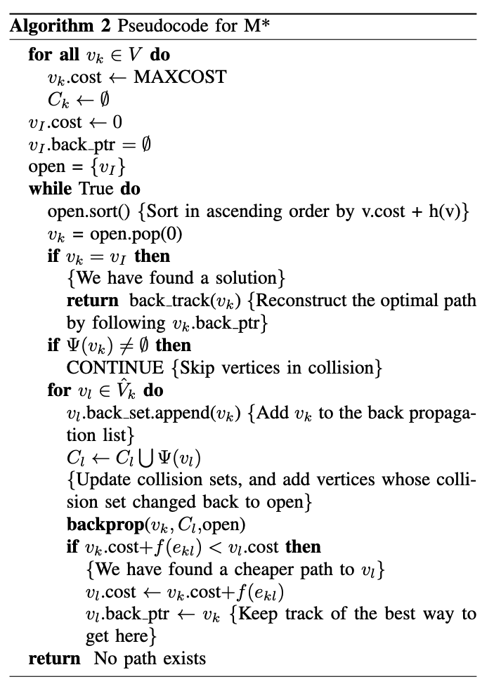
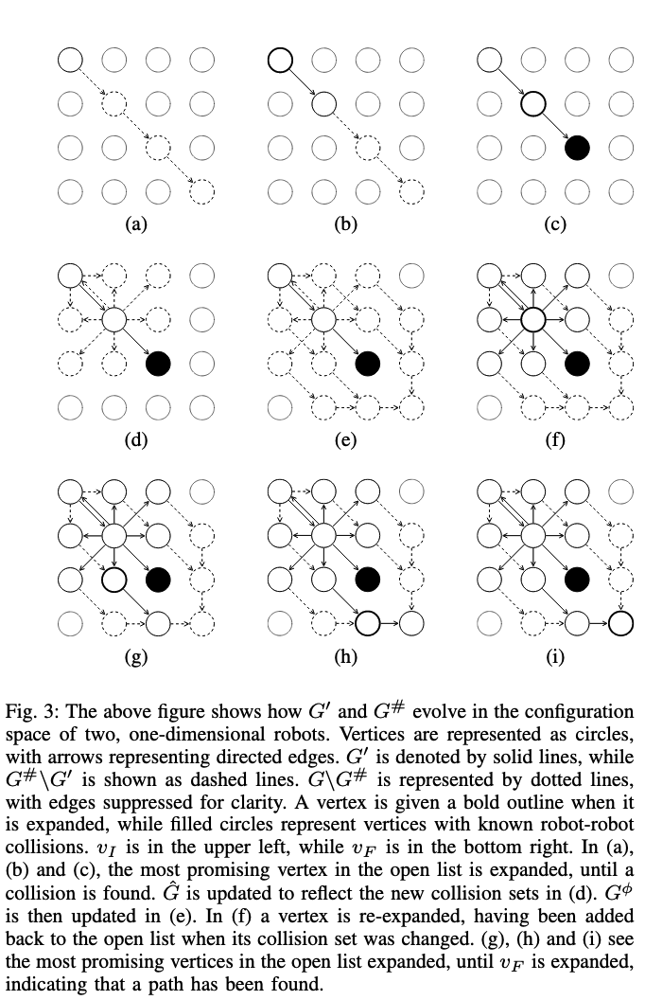

# M-star 

论文阅读

## CBS 论文中对于 M* 的描述

M* 是一种与ID相关的算法。它是一种基于 A* 的算法，可根据冲突动态更改分支因子。通常，扩展节点仅生成一个子节点，其中每个机器人都朝着目标进行最佳的移动。这种情况一直持续到节点 n 处的 q ≥ 2 个机器人之间发生冲突。在这种情况下，需要在本地增加搜索维度。M* 从 n 向上追溯到 n 的所有祖先，直到根节点和所有这些节点都放回 OPEN 中。如果其中一个节点再次扩展，它将生成 bq 子节点，其中 q 冲突机器人进行所有可能的移动，而 k − q 非冲突的机器人进行最佳移动。

一种称为递归 M* （RM* ）  [51] 的增强版本将 q 冲突机器人划分为机器人子组，每个子组具有独立的冲突。然后，在每个组上递归调用 RM*。一种名为 ODRM* [17] 的变体将 Standley 的算子分解（参见第 3.3.7 节）结合在 RM* 之上。

## 摘要

多机器人路径规划很困难，因为 整个系统的配置空间 随着机器人数量的增加呈指数级增长。

所以 M* 会有两步操作：

1. 首先对每个机器人进行单独的规划
2. 然后对发生冲突的几组机器人进行路径重规划

从而最大限度地减少搜索空间的维度

提出了一种叫做 子维度扩展（subdimensional expansion）的通用策略：可以动态生成低维度的搜索空间嵌入到完整的配置空间中去。

然后还提出了一个机器人配置空间中的子维度扩展的算法实现，也就是 M*

可以把机器人运动的配置空间表示成一个 **图**

## 1 介绍

- 多机器人路径规划的根本问题是 **处理 高纬度的搜索空间**

- 多机器人路径规划算法可分为 **耦合** 和 **解耦** 两类
  - **耦合**（Coupled）表示算法考虑多个机器人之间的相互影响和依赖，也就是在完整的配置空间中寻找路径，优点是可以保证找到最佳的路径，但是对于多机器人系统来说计算量非常大，一般是不可行的
  - **解耦**（decoupled）表示算法将多个机器人的路径规划问题分解为单独的子问题，使得它们之间的影响降到最低。优点是可以快速地产生结果，但是不能保证找到最优解

- 针对上述问题，本文提出一种同时具有 耦合和解耦 方法的优点的算法，称之为子维度扩展（subdimensional expansion）。
- 在搜索空间中发现机器人之间的碰撞时，会在**局部增加空间的维度**，以构建一个最小的搜索空间，其中包含具有所需属性的路径。

**M* 算法** 是一种基于**A* 路径规划算法的子维度扩展方法**，适用于可以表示为图形的配置空间。作者证明了M* 算法是完备且最优的，然后通过模拟展示，相较于A* 算法，M*算法在寻找多机器人系统路径时需要的时间显著减少。

## 2 先前工作

先前存在许多算法，可以动态改变机器人的耦合方式，以达到规划目的。

- Krishna等人开发了一种用于机器人速度规划的分散式动态耦合方法。
  - 在他们的算法中，机器人首先尝试通过 **独立改变其速度** 来解决潜在的碰撞。如果这种方法不成功，那么参与碰撞的机器人会合作找到一个安全的速度计划。如果这也失败了，它们会招募未参与的机器人来改变它们的速度，以便找到一个解决方案。这种方法永远不会改变机器人所跟随的空间路径，因此既**不完备也不最优**。
- Clark等人引入了 **动态网络** ，明确地搜索不同大小的配置空间。对于能够相互通信的机器人组，计算联合计划。每当新的机器人加入组时，路径就会重新规划。这种方法 **会导致不必要的耦合**，因为并非所有能够通信的机器人都需要合作来找到安全路径，而且仅考虑局部交互。
- Van den Berg等人开发了一个 **规划时间算法**，以找到一种耦合策略，该策略最小化了需要耦合的机器人集合的大小，以确保找到解决方案。这些机器人被限制为按顺序移动，这导致了哪些机器人必须在其他机器人之前或之后移动的约束。这些约束中的循环可以用来找到需要耦合规划的机器人集合。这种方法不太理想，因为它对机器人运动施加了限制，导致非最优路径，并且它执行的耦合具有全局性质。
- 机器学习领域也一直在努力确定 **何时需要耦合多个机器人**。
  - Kok等人提出了一种方法，该方法对机器人**进行个体化的Q-learning**，但存储了探索的联合行动的奖励统计数据。如果这些统计数据表明在特定空间协调行动是有益的，那么算法就开始学习在该状态下进行协调行动。这种方法的好处是能够处理除了基本路径规划之外的任务，例如需要多个追捕者协调行动来捕捉目标。
  - Melo和Veloso开发了一种Q-learning算法，该算法将“协调”行动添加到每个机器人可用的行动集中，该行动利用最近邻机器人的状态来帮助选择要执行的行动。然后，只有当机器人学会执行协调行动时，机器人之间才发生协调。我们的工作**侧重于在搜索的上下文中进行动态耦合**，而不是强化学习。

## 3 子维度扩展

### A. 问题描述

---

定义：

---

任务目标是在一个共同的 **工作空间 $W$中为一组 $n$ 个机器人找到一个最优的、无碰撞的路径** ，从指定的初始配置到目标配置。我们用集合 $I = \{1, . . . , n\}$ 对机器人 $r_i$​ 进行索引。为了简洁起见，我们将用机器人的索引来代表机器人。我们使用 **上标** 来指示哪些机器人由一个集合、空间或元素描述，而 **下标** 则表示空间中的特定位置或集合中的特定元素。

每个机器人 $r_i$ 都有一个无障碍的 配置空间 $Q_i$ 。整个系统具有一个无障碍的 配置空间$Q = ∏_{i∈I} Q_i$，然而 $Q$ 中仍然存在导致不同机器人之间碰撞的状态。我们需要经常处理子空间，因此我们使用符号 $Q^Ω = ∏_{i∈Ω} Q_i $，来表示机器人子集 $Ω ⊂ I$ 的联合配置空间。这个符号也用于描述机器人子集的路径、机器人子集的位置等等。

由于每个点 $q_k ∈ Q$ 同时描述了每个机器人的位置，$Q$ 中的路径隐式地提供了时间协调。**如果成本函数取决于时间，时间可以被添加为机器人状态的一个元素。**这样做会导致最小的性能损失，因为所有机器人都具有相同的时间动态。因此，在搜索Q时，每个机器人的时间维度将折叠成一个单一的有效维度。

我们使用 $π(qk， ql)$ 来表示从 $q_k ∈ Q$  到 $q_l ∈ Q$  的路径上的点集，并使用 $π^∗(q_k， q_l)$ 来表示最小化指定成本函数的无冲突路径。我们的**目标是找到从初始状态 $q_I$ 到目标状态 $q_F$ 的最优无碰撞路径 $ π^∗(q_I ， q_F)$。**（**即从起始点到达目标点的最短无碰撞路径**）。

我们希望最小化 **成本函数**  $f (π(q_k, q_l))$。我们假设完整配置空间中的路径成本等于 **单个机器人的路径成本之和**：
$$
f(\pi(.))=\sum_{i\in I}f^i(\pi^i(.))\quad\pi^i(.)\subset Q^i
$$
如表达式（1）所示，保证了**成本函数可以分解为每个机器人的单独成本函数**。

对于在 $Q$ 中的路径 $π(q_I, q_F)$​，分别优化每个单独机器人路径的代价是最小的。虽然这样的路径几乎肯定会包含至少一个机器人之间的碰撞，但仍然有助于指导寻找一个无碰撞路径。

为了确保任何有限成本的路径都具有有限的长度（避免出现某条路径在终点附近徘徊），我们作如下要求：
$$
\exists\epsilon>0~s.t.~f^i(\pi^i(q_k^i,q_l^i))>\epsilon\quad q_k^i,q_l^i\in Q^i
$$

我们还定义了一个碰撞函数 $Ψ^{ij}$：
$$
\left.\Psi^{ij}(q^i,q^j)=\left\{\begin{array}{rl}\{i,j\},&A(q^i)\cap A(q^j)\neq\emptyset\\\emptyset,&\mathrm{otherwise}\end{array}\right.\right.
$$
简单来说，这个函数用于判断两个不同机器人 i 和 j 在给定的位置 $q_i$ 和 $q_j$ 时是否发生碰撞。如果$qi$和$qj$对应的空间有交集（即$A(q^i)$和$A(q^j)$不为空），则返回${i,j}$​，表示发生了碰撞；否则返回空集合表示没有发生碰撞。

然后我们还定义了一个全局的碰撞函数
$$
\Psi(q)=\bigcup_{i\neq j\in I}\Psi^{ij}(q^i,q^j)
$$

### B. 实现方法

**子维度扩展** 利用满足 (1) 和 (4) 式的系统中机器人的自然解耦，来构造一个足够低维的搜索空间Q#，该空间嵌入在Q中。

我们使用路径规划算法（称为 **规划器**，也就是本文提出的 M*）来搜索 Q#。

在搜索Q#时，规划器会找到机器人之间的碰撞信息，然后利用这些信息来 **局部增加Q#的维度**。

通过这种方式允许我们可以搜索低维空间，同时保证所需的路径最终将存在于搜索空间中。

对于每一个机器人，我们会给他定义一个独立的最优策略：$\phi^i:Q^i\to TQ^i$ ， 这个式子将机器人的位置映射到其运动。

也就是说， $\phi^i$ 策略的意义是：遵循$ \phi^i$ 产生的路径，从任意点 $q_k^i\in Q^i$ 到 $q_F^i\in Q^i$ 都是一条最优路径。

$\phi^\Omega(q^\Omega)=\prod_{i\in\Omega}\phi^i(q^i)$  - 表示机器人的一个子集的单独最优策略 Ω

当 $\Omega=I$ 时 -  $\phi(q)=\prod_{i\in I}\phi^i(q^i)$

两种路径：

- $\pi^{\phi^{\Omega}}(q^{\Omega},q_{F}^{\Omega})$  : 遵循策略 $\phi^\Omega(q^\Omega)$  的一种路径
- $\pi^\phi(q,q_F)$ ： 遵循策略 $\phi(q)$ 的一种路径

我们把这些路径称为独立优化路径（individually optimal paths）

由 (1) 式可知 ， $f(\pi^\phi(q_k,q_F))$ 是所有路径 $\pi(q_k,q_F)$​​ 成本的下限。

在搜索过程中的每一步，我们都乐观地认为，除非我们有相反的具体信息，否则来自 qk 的单个最优路径将是无冲突的。

我们为每个 $q_{k}\in Q$ 维护一个碰撞集 $C_{k}$，这是 $q_{k}$  的乐观 观点无效的机器人集。设 $\Pi(q_{k})$ 是规划器搜索的通过  $q_{k}$  的路径集。$C_{k}$ 的定义如下：
$$
C_k=\bigcup_{\pi\in\Pi(q_k)}\Psi(\pi)
$$
这个碰撞集$C_k$ 就是由所有的机器人 

规划器发现了一条从 $q_k$ 到一个冲突点的路径上的所有机器人 $r_i$

我们也希望能限制我们保持乐观观点的机器人集，$\bar{C}_k=I\backslash C_k$，到他们各自的最佳路径，符合我们乐观的信念，即这条路径是无碰撞的。但是，我们不会对 $C_k$ 中的机器人施加这样的限制，因为我们已经知道乐观的观点并不成立。我们通过正确选择 Q# 的切线空间 $T_{q_k}Q^{\#}$ 在 qk 处，在搜索空间 Q# 的几何图形中对这些约束进行编码。

$$
T_{q_k}Q^\#=\mathbf{t}^{\bar{C}}(q_k)\times\prod_{j\in C_k}T_{q_k^j}Q^j
$$
我们将机器人 $\bar{C}_k$ 的子集限制为沿向量 $\mathbf{t}^{\bar{C}}(q_k)$ 的方向移动，该向量 $\mathbf{t}^{\bar{C}}(q_k)$ 与该机器人子集的单独最优路径 $\pi^{\phi^{\bar{C}_k}}\left(q_k^{\bar{C}_k},q_F^{\bar{C}_k}\right)$ 相切，位于 qk。

这在局部限制了 $\bar{C}_k$  中的机器人，使其只能使用各自的最佳路径。我们需要对 Ck 中的所有机器人进行详尽的搜索，因此必须考虑此类 ri 可以移动的所有方向的集合，即 $T_{q_k^i}Q^i$​。

现在我们可以通过从 $q_I$ 开始并利用切空间的定义来微分地扩展 Q# 来构建 Q# 。

初始状态下，Q# 将是 $\pi^\phi(q_I,q_F)$ ，然后随着规划者发现机器人与机器人的碰撞，Q# 将沿着各种子空间增长。

## 4 M* 算法

M* 算法是子维度扩展思想的一种实现，首先需要将每一个机器人 ri  的配置空间表示为有向图  $G^i=\{V^i,E^i\}$

其中：

- Vi 是机器人 ri 的配置空间 Qi 中位置的顶点集合
- Ei 是 Vi 中的顶点之间有效转换的有向边集合

将配置空间表示为图之后，就可以将路径规划问题转换为图搜索问题，于是我们就能够将 M* 建立在 A* 的基础上。

介绍一下A* :

​	A* 是一种完整且最优的图搜索算法 [8]。回想一下，A* 维护着一个开放的顶点 vk 列表来探索。它们根据最便宜路径 π(vI , vk) 的成本和启发式成本之和进行排序，启发式成本是任何路径 π(vk, vF ) 成本的下限。在每次迭代中，从开放列表中取出最有希望的顶点 vk 并进行扩展。对于 vk 的每个邻居 vl，A* 检查通过 vk 到达 vl 是否是迄今为止找到的到达 vl 的最便宜路径。如果是，则将 vl 添加到开放列表中。这样一直持续到 vF 扩展为止，表明已经找到了到达目标的最佳路径。

和 A* 有些不同的是，在路径扩展的阶段，M* 只考虑 vk 的一部分邻居节点，具体选择哪些节点取决于Ck

有限邻居 $\hat{V}_{k}$ 的集合是当根据其单独的最优策略 $\phi^i(v_k^i)$ 移动机器人$r^i\in\bar{C_k}$ 时，可以从 vk 到达顶点 vl 的集合，其中 $v_k^{i}$ 是系统在 vk 时 ri 的位置。相反，机器人 $r^j ∈ C_k$ 被允许移动到 Qj 中 $v_k^{j}$ 的任何邻居
$$
\left.\left.\hat{V}_k=\left\{v_l|\forall i\in I,v_l^is.t.\left\{\begin{array}{rr}e_{kl}^i\in E^i,&i\in C_k\\v_l^i=\phi^i(v_k^i),&i\notin C_k\end{array}\right.\right.\right\}\right.
$$
如果 $\Psi(v_{k})$不为空集，我们设置 $\hat{V}_k=\emptyset $，以防止 M* 考虑通过碰撞点的路径。

我们需要一种有效的方法来保持碰撞集的更新，这是通过沿着到达碰撞的所有搜索路径传递有关碰撞的信息来实现的。

为此，我们为每个顶点 vk 维护一个反向传播集，该集是当 vk 处于 $\hat{V_{l}}$ 状态时展开的所有顶点 vl 的集合。

因此，反向传播集是 vk 的邻居集，规划者通过它找到了通往 vk 的路径 我们通过将 $C_k=\Psi(v_k)$  添加到 vk 反向传播集中每个 vl 的 Cl 来传播有关 vk 处碰撞的信息。

然后，我们将 Cl 添加到 vl 的反向传播集中每个顶点的碰撞集中，并重复此过程，直到遇到包含 Ck 的碰撞集。

由于 $\hat{V_{l}}$ 依赖于 Cl，因此更改 Cl 会将通过 vl 的新路径添加到搜索空间。因此，必须将 vl 添加回打开列表，以便可以搜索这些新路径（参见 **Algorithm 1** ）。

最后，我们注意到，由于 $f(\pi^\phi(v_k,v_F))$  是所有路径 $\pi(v_k,v_F)$  成本的下限，因此它显然是用作 M* 的启发式函数的选择。我们定义启发式函数：
$$
h(v_k)=f(\pi^\phi(v_k,v_F))\leq f(\pi^*(v_k,v_F))
$$
M* is described in algorithm 2.

### M* 算法基于图的描述

IV-A中给出的M* 描述提供了搜索过程的局部描述。现在，我们提出了一个替代描述，它更好地捕捉了 M* 的全局属性，但不适合实现。

在检查算法 2 时，我们看到 M* 与 A* 的 **不同之处仅在于 backprop 函数的存在**，以及在探索 vk 路径时使用 Vˆk 代替 G 中 vk 的所有邻居。

只有当找到一个或多个冲突的新路径时，backprop 函数才会产生非平凡的结果。

因此，M* 的行为与在图形 G# 上运行的 A* 完全相同，其中 G# 中 vk 的邻居是 Vˆk 中的顶点，直到 A* 找到新的机器人-机器人碰撞。

通过将 M* 视为在 G# 上运行 A* 和根据搜索结果更新 G# 之间交替进行，我们可以利用 A* 的最优性和完整性属性来证明 M* 的类似属性。

G# 由三个子图组成：G′、Gˆ 和 Gφ。G′ 是 G# 中被 M* 搜索的部分，Gˆ 表示 G′ 中顶点的有限邻居，Gφ 通过服从 φ 将 Gˆ 中的顶点连接到 vF。

被 M* 搜索的 G 部分由图形 G′ = {V ′， E′} 表示。V ′ 是已添加到开放列表中的顶点集。E′ 由连接每个顶点 vk 的有向边 ekl 组成，该顶点已扩展 M* 至顶点 vl ∈ Vˆk。

由于 G′ 表示规划器搜索过的所有路径，因此我们可以使用 G′ 来定义碰撞集：
$$
\left.C_k=\left\{\begin{array}{cc}\Psi(v_k)\bigcup_{v_l~s.t.~\exists\pi(v_k,v_l)\subset G'}\Psi(v_l)&v_k\in G'\\\emptyset&v_k\notin G'\end{array}\right.\right.
$$
如果 vk 不属于 G′，那么 M* 从未访问过 vk，我们也从未计算过 Ψ(vk)。

在 M* 实际访问 vk 之前，我们乐观地认为 vk 和 $\pi^\phi(v_k,v_F)$ 是无冲突的，因此设置$C_k=\emptyset\mathrm{~and~}\hat{V}_k=\phi(v_k)$。

我们表示当 vk 被图 $\hat{G}_{k}$ 扩展时将要探索的图部分，该图是由 vk、其有限的邻居 $\hat{V}_{k}$ 以及连接 vk 和 $\hat{V}_{k}$ 中的顶点的边形成的图。设 $\hat{G} = \bigcup_{v_k\in G^{\prime}}\hat{G}_k$​ 

由于 $C_{k}=\emptyset $ 对于不在 G′ 中的所有 vk，我们知道，只要这条路径完全位于 G′ 之外，从 vk 的搜索将被限制为 $\pi^\phi(v_k,v_F)$。让图形 $G_{k}^{\phi}$ 表示 $\pi^\phi(v_k,v_F)$ 从 vk 到 G′ 中路径上的第一个顶点的部分，或者如果 $\pi^\phi(v_k,v_F)$ 从不重新进入 G′，则表示 vF。

现在，我们可以将 G# 定义为：
$$
G^\#=G^{\prime}\bigcup_{v_k\in G^{\prime}}\left(\hat{G}_k\bigcup_{v_l\in\hat{G}_k\setminus G^{\prime}}G_l^\phi\right)
$$

由于我们对 G′、Gˆ 和 Gφ 的定义，当 M* 搜索 G# 时，顶点和边会从 Gφ 移动到 Gˆ，并从 Gˆ 移动到 G′。参见图 3，了解子图如何随时间变化。但是，只有当 G# 中顶点的碰撞集发生更改时，G# 作为一个整体才会发生变化。

​	上图展示了在两个一维机器人的配置空间中，G'和G#是如何演变的。顶点用圆圈表示，箭头表示有向边。G'用实线表示，而G#\G'则用虚线表示。G\G#用点线表示，为了清晰起见，边被省略了。当一个顶点被扩展时，它被给予粗体轮廓，而实心圆表示具有已知机器人-机器人碰撞的顶点。vI在左上角，而vF在右下角。在(a)、(b)和(c)中，打开列表中最有希望的顶点被扩展，直到发现碰撞。Gˆ被更新以反映(d)中的新碰撞集。然后在(e)中更新Gφ。在(f)中，一个顶点被重新扩展，当其碰撞集发生变化时，它被添加回打开列表。在(g)、(h)和(i)中，打开列表中最有希望的顶点被扩展，直到扩展vF，表示已找到一条路径。

## 5 完整性和最优性

完整性：如果路径规划算法保证在有限时间内找到路径或确定不存在路径，则该算法是完整的。

最优性：我们还希望证明 M* 是成本最优的，这意味着 M* 将找到一条最小化成本函数的路径。

如 IV-B 所示，我们可以将 M*  视为在图形 G# 上运行 A*  搜索和根据 A* 搜索结果修改 G# 之间的交替。

由于 A* 是完全的且成本最优的，如果我们证明 G# 在有限次数的修改后将包含$\pi^*(v_I,v_F)$，或者如果 $\pi^*(v_I,v_F)$  不存在，则 G# 最多将被修改有限次，我们可以证明 M* 是完全的和成本最优的。

我们首先假设不存在解，并证明 M* 将在有限时间内终止而没有找到路径。仅当修改 G# 中至少一个顶点的碰撞集时，才会修改 G#。

每当修改碰撞集时，都会将一个或多个机器人添加到碰撞集中，因此每个碰撞集最多可以修改 n−1 次，因为第一次修改必须添加至少两个机器人。

G# 可能包含一个路径 π（.） 在 vk 处发生机器人-机器人冲突。这只有在 $v_{k}\notin G^{\prime}$ 时才会发生，否则包含机器人-机器人碰撞的顶点将没有任何外邻。但是，在 M\* 返回这样的路径之前，vk 将被添加到打开列表中，从而添加到 G′。因此，G# 将被修改以删除 vk 的外邻居，从而删除无效路径。因此，M\* 永远不会返回包含冲突的路径。我们可以得出结论，如果不存在解，M\* 将确定在有限时间内不存在有效路径。

接下来，假设存在从 vI 到 vF 的路径。我们将首先证明，如果两种情况中的一种总是为真，则 M* 将找到一个最佳的、无碰撞的路径。然后，我们将证明这两种情况中的一种必须始终成立。假设 G# 始终包含：
- Case 1: 一条最优的，无碰撞的路径 $\pi^*(v_I,v_F)$
- Case 2: 一条路径 $\pi(v_I,v_k)$ 基于以下条件：$f(\pi(v_I,v_k))+h(v_k)\leq f(\pi^*(v_I,v_F))$ 且 $\exists v_l\in\pi(v_I,v_k)\text{s.t. }\Psi(v_k)\not\subset C_l$

如果 Case 1 成立，则在 G# 上运行 A* 将找到 $\pi^*(v_I,v_F)$，除非存在更便宜的路径$\tilde{\pi}(v_I,v_F)\quad\subset\quad G^\#$。

vk 必须在$G^\#\backslash G^{\prime}$​上，否则，VK 将没有外邻居，因此没有路径可以穿过 VK。由于 vk 不在 G′ 中，因此 Ck = ∅，因此 Ψ（vk） 6⊂ Ck。因此，vk 在情况 2 中同时满足 vl 和 vk 的角色，因此满足情况 2。我们可以得出结论，如果情况 1 成立，那么 M* 将找到 π∗（vI ， vF），除非情况 2 也成立。

如果 Case 2 成立，则在 A* 找到任何成本高于$f(\pi^*(v_I,v_F))$ 的 vF 路径之前，vk 将被添加到 G′ 。

将 vk 添加到 G′ 将导致修改 Cl，更改 G# 以反映新的 Vˆl，并重新启动 A* 搜索。因此，只要情况 2 成立，M* 就永远不会返回次优路径。

要使 Case 2 成立，必须至少有一个顶点 vl，使得 Cl 是 I 的严格子集。 G# 最多可以修改 $(n-1)*|G|$ 次，直到所有碰撞集之前的次数都等于 I。因此，情况 2 只能适用于有限数量的 G# 修改。由于情况 1 或情况 2 都由假设成立，因此在有限时间后，只有情况 1 成立。由于如果只有情况 1 成立，M* 总是会找到 π∗（vI ， vF），如果情况 2 成立，则找不到次优路径，因此 M* 将在有限时间内找到 π∗（vI ， vF）。

## 6 相较于 A* 的优势

虽然 M* 的最坏情况下计算成本随着机器人数量的增加而呈指数增长，但 A* 的成本也是如此，但 M* 在一般情况下有两个实质性优势。

1. 与 A* 不同，M* 不需要将每个邻居都添加到打开列表中。对于 A* 来说，这样做很快就会变得令人望而却步，因为在四个连接的网格上由 13 个机器人组成的系统中，一个顶点有超过 10 亿个邻居。
2. A* 必须考虑配置空间中 $f(\pi^*(v_I,v_k))+h(v_k)<f(\pi^*(v_I,v_F))$ 的所有区域。当 M* 代表未参与碰撞的机器人的备用路径时，M* 可以安全地忽略这些区域。考虑图 4 中的情况。机器人 1 可以安全地与机器人 2 和 3 的规划分离，但具有多个最佳路径。因此，亚维扩展可以安全地将机器人 1 限制在单个最优路径上，并分别规划机器人 2 和 3。A* 无法识别这种解耦，因此必须考虑机器人 1 的所有最佳路径以及它考虑的机器人 2 和 3 的任何关节路径。

## 7 变种

### A. Inflated M*   （膨胀 M*）

基础的 M* 实现的一个问题是，每当发现一个新机器人参与碰撞时，它就会被添加到 vI 的碰撞集中。

除非$f(\pi^*(v_I,v_F))= f(\pi^\phi(v_I,v_F))$

vI必须以指数级别的计算成本重新扩展，该成本与发现发生碰撞的机器人总数成正比，如果启发式方法乘以一些 $\epsilon>1$，A* 将找到一条成本不超过 $\epsilon*f(\pi^*(v_I,v_F))$ 的路径，并且通常会更快地找到一条路径。第五节中的逻辑可以扩展为表明，当与膨胀启发式方法一起使用时，M*具有相同的次优性边界。

膨胀的启发式方法使搜索偏向于靠近目标的搜索树的叶子，更有可能快速找到解决方案。此外，这些顶点通常具有较小的碰撞集，从而导致维度较低的搜索空间。

### B. Recursive M* （递归 M*）

M*可以改进的另一个领域是处理多个物理上分离但同时相互作用的机器人组。基础的 M * 必须耦合所有此类机器人集之间的规划，即使它们可能没有相互交互。我们可以将方程（11）-（15）从处理单个机器人子集的耦合规划扩展到单独规划多个不相交的机器人子集，Ck，. . . . ， Co.

因此，我们可以为每个独立的交互机器人集找到一条路径，并使用生成的路径来约束探索，就像使用单个最优策略来约束单个机器人的探索一样。这样做会导致最坏情况下的计算成本，即在最大的相互碰撞机器人集的大小上呈指数级增长，而不是在碰撞机器人的总数上。我们将这种变体称为递归 M* 或 rM*。

实现递归 M* 需要相对较少的修改。首先，碰撞集现在由最大的不相交集组成，这些不相交集可以从 vk 到达的碰撞中形成。例如，如果冲突 {1， 2}， {2， 3}， {4， 5} 可以从 vk 到达，则 Ck = {{1， 2， 3}， {4， 5}}。如果 ri 不在 Ck 的任何元素中，则它服从 φi。否则，ri 将遵循其所属的机器人子集 Cˆ ∈ Ck 的最佳路径。通过使用 rM* 递归查找这些子问题的路径，可以找到此路径。在Ck中每个机器人子集的路径上，vk的后继者与φC ̄k（vC ̄k）相结合，为vk生成一个后继者。例外情况是，如果 Ck = I，在这种情况下，Vˆk 像往常一样计算 M*，使用 Cˆ 作为碰撞集。这用作对 rM* 的递归调用的基本情况。

## 8 结论

我们在 2.80 GHz 和 12 Gb RAM 的 Core i7 计算机上运行的模拟中测试了 M*。所有模拟都是在未经优化的 python 中实现的。我们选择使用一个方形的四连接网格，每个机器人的密度为 104 个单元作为我们的工作空间。通过增加机器人数量来扩展工作空间，可以使工作空间中的机器人密度保持不变，从而允许我们在不改变机器人拥挤程度的情况下改变机器人的数量。工作区中的每个单元格都有 35% 的独立几率被标记作为障碍。每个机器人的初始位置和目标位置是随机选择的，但选择的路径总是从机器人的初始位置到其目标位置（图5）。每个机器人在不处于其各自目标状态时会产生 1 的成本，而在处于目标状态时则没有成本。每次试验最多有五分钟的时间来找到解决方案。我们为每个数量的机器人测试了 100 个随机环境。

我们运行 了A* 、M*  和 rM* ，同时使用未膨胀的启发式方法和 2 倍的启发式方法。我们记录了在五分钟内找到解决方案的试验百分比，以及在第 10、50 和 90 个百分位的试验中找到解决方案所需的时间。运行时间绘制在半对数图上，其中随着机器人数量的增加呈指数增长，将显示为直线（图 6）。

A* 无法找到涉及七个或更多机器人的问题的任何路径，因为将每个扩展顶点的所有邻居添加到开放列表的成本很高。找到解决方案所需的时间显示了随着机器人数量的增加而呈指数级增长的预期。M* 和 rM* 的性能都明显优于 A*。在 10 个机器人中，rM* 的成功率大约是 M* 的三倍，但当启发式函数膨胀时，性能提升甚至更大。对于包含 20 个机器人的系统，使用膨胀启发式方法，rM* 的运行时间比基本 M* 少大约一个半数量级，并且成功率合理，可以扩展到两倍的机器人数量（图 6）。最重要的是，膨胀 rM* 的求解时间图在对数轴上显然是亚线性的。这说明对于我们调查的环境来说，rM* 的平均情况计算成本随着机器人数量的增加呈次指数增长。

将时间限制增加到 25 分钟，我们能够计划 100 个机器人，成功率为 83%，解决时间中位数为 54 秒。但是，M* 的内存受到严重限制，我们无法大幅增加运行时间来处理更棘手的问题。

## 9 未来的工作

M* 的一个弱点是，如果足够数量的机器人集中在一个阻塞点，搜索将失败，因为这将迫使 M* 搜索过大的空间。扩展节点的成本以可预测的方式增长，因此当顶点的碰撞集“太大”时，确定相对容易。rM* 的一个可能的解决方案是使用优先级规划器 [6] 而不是递归调用 M* 来为被认为“太大”的机器人集生成策略。虽然这样做会导致完整性和最佳性保证的丧失，但它可能允许在内存和时间限制内找到路径，否则是不可能的。在需要这种方法的情况下，向用户发出无法保证最优性的信号是微不足道的。

除 A* 外，子维扩展还可以应用于路径规划算法。我们打算探索使用 D* [22] 和 Anytime A* [17] 作为离散世界中亚维扩展的规划器。我们将通过使用 PRM 生成表示单个机器人配置空间的图形 [10] 将 M* 应用于更复杂的环境。具有运动动力学约束的系统可以通过使用 RRT [14] 作为规划器来实现亚维扩展来处理。这可以通过修改 RRT 向样本扩展的方式来实现。只有碰撞集中的机器人才会实际朝向样本指定的坐标移动。所有其他机器人将遵循它们的个别策略。
